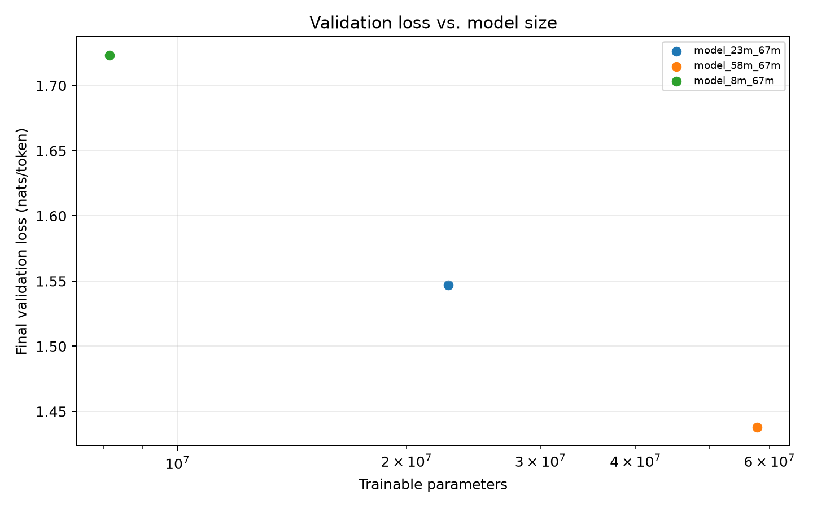
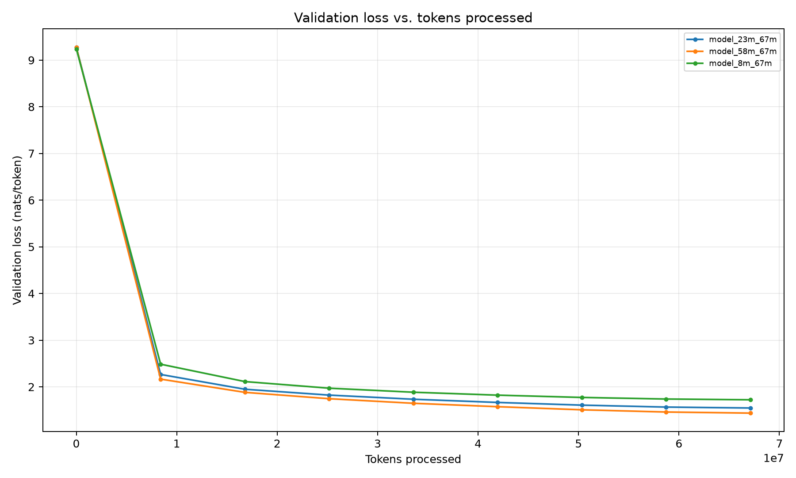
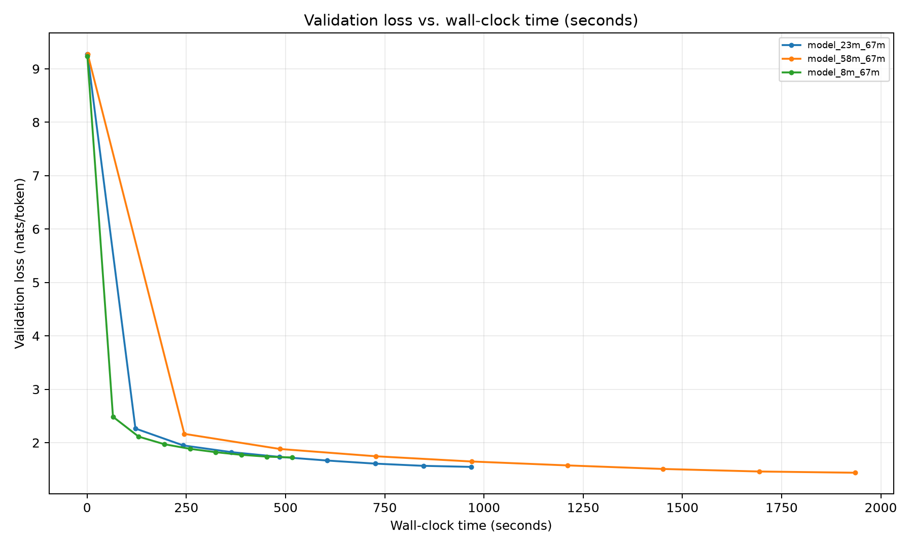

# TinyStories Language-Model Experiments

This report summarizes eight controlled training runs of decoder-only Transformers implemented from scratch for Stanford CS336 Assignment 1. The runs cover learning-rate selection and model scaling on a single consumer GPU.

## Experimental setup

- **Dataset:** TinyStories, tokenized with a 10,000-token BPE vocabulary
- **Data:** 540,796,778 training tokens and 5,461,210 validation tokens
- **Hardware:** NVIDIA GeForce RTX 4070 Ti SUPER (16 GB)
- **Software:** PyTorch 2.6.0+cu124
- **Training:** context length 256, batch size 32 (8,192 tokens/step), AdamW, gradient clipping at 1.0, linear warmup followed by cosine decay
- **Evaluation:** 20 deterministic validation batches (163,840 tokens) per checkpoint, with training seed 42 and validation seed 1337
- **Code baseline:** commit `037b97a`

The short-budget sweep used 2,048 steps (16,777,216 token exposures per run). The scaling study used 8,192 steps (67,108,864 token exposures per model), so comparisons within each study hold the token budget and all non-target settings constant. Across the eight unique runs, training processed 285,212,672 token exposures.

## Learning-rate sweep

The 22.7M-parameter model was trained at three peak learning rates. The minimum learning rate was one tenth of the peak rate, and warmup covered 10% of training.

| Peak learning rate | Best validation loss | Perplexity | Wall time | Median throughput |
| ---: | ---: | ---: | ---: | ---: |
| 3e-4 | 2.1896 | 8.93 | 247 s | 67.8k tokens/s |
| **1e-3** | **1.8573** | **6.41** | 248 s | 67.6k tokens/s |
| 3e-3 | 1.8813 | 6.56 | 251 s | 66.8k tokens/s |

Of the tested values, `1e-3` performed best. It reduced validation loss by 15.2% relative to `3e-4` and by 1.3% relative to `3e-3`, so the scaling study used `1e-3`.

## Fixed-token model scaling

Each model below received exactly 67,108,864 token exposures.

| Parameters | Architecture (`d_model`, layers, heads) | Best validation loss | Perplexity | Wall time | Median throughput | Peak GPU memory |
| ---: | :---: | ---: | ---: | ---: | ---: | ---: |
| 8.1M | 256, 4, 8 | 1.7230 | 5.60 | 517 s | 129.4k tokens/s | 2,684 MiB |
| 22.7M | 512, 4, 16 | 1.5469 | 4.70 | 968 s | 69.3k tokens/s | 4,265 MiB |
| 57.8M | 768, 6, 16 | **1.4377** | **4.21** | 1,935 s | 34.6k tokens/s | 7,371 MiB |

At the same token budget, scaling from 8.1M to 57.8M parameters reduced validation loss by **16.6%** and perplexity by **24.8%**. The tradeoff was training efficiency: the 8.1M model delivered **3.74x** higher throughput and used **63.6% less peak GPU memory**. Scaling from 22.7M to 57.8M parameters improved validation loss by 7.1%, while approximately doubling wall time and increasing peak memory by 72.8%.







## Reproducing the analysis

The CSV logs and their configuration manifests are versioned under `logs/controlled/` and `logs/long/`. Regenerate the scaling summary and figures with:

```powershell
uv run python -m cs336_basics.analyze_experiments `
  --log_dir logs/long `
  --output_dir results/model_scaling_67m
```

The generated numeric summary is in [`results/model_scaling_67m/summary.csv`](results/model_scaling_67m/summary.csv).

## Limitations

These are single-seed, fixed-token experiments on TinyStories. They establish a controlled comparison for this implementation and hardware, but they do not estimate run-to-run variance, test compute-optimal scaling, or imply performance on broader language-modeling datasets.
